# 💰 SpendSense – AI-Powered Expense Tracker

**Smart spending, smarter life**


---

## 📚 Table of Contents

1. [Overview](#overview)
2. [Screenshots](#screenshots)
3. [Key Features](#key-features)
4. [Problem & Solution](#problem--solution)
5. [Tech Stack](#tech-stack)
6. [Architecture](#architecture)
7. [Project Structure](#project-structure)
8. [How It Works](#how-it-works)
9. [Challenges & Learnings](#challenges--learnings)
10. [Installation](#installation)
11. [Future Enhancements](#future-enhancements)
12. [Author](#author)
13. [License](#license)
14. [Acknowledgements](#acknowledgements)

---

## 📖 Overview

**SpendSense** is a modern Android expense tracker that combines effortless expense logging with AI-powered financial insights. Built entirely with Jetpack Compose and Material 3, it lets users record expenses in seconds, visualize spending patterns through interactive charts, and receive personalized AI recommendations powered by Google Gemini 1.5 Flash — all while working completely offline for core features.

SpendSense is designed for anyone who wants to understand and take control of their personal finances, whether they're a student tracking daily coffee runs or a professional managing a monthly budget across multiple currencies. The app supports 13+ currencies with proper locale-aware formatting, making it globally accessible from day one.

This project was built to demonstrate modern Android development practices: clean MVVM architecture with a Repository pattern, offline-first data management using Room and Kotlin Flow, AI integration via REST, and a polished UI featuring glass morphism cards, shimmer skeletons, animated counters, and adaptive light/dark/dynamic theming — all production-grade patterns applied in one cohesive app.

---

## 📱 Screenshots

| Screen | Light Mode | Dark Mode |
|--------|------------|-----------|
| **Splash Screen** | 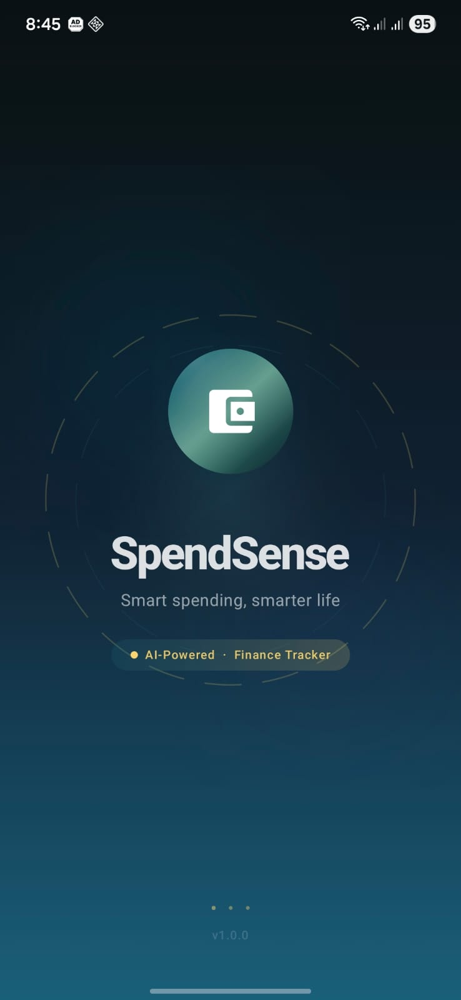 | — |
| **Onboarding** | 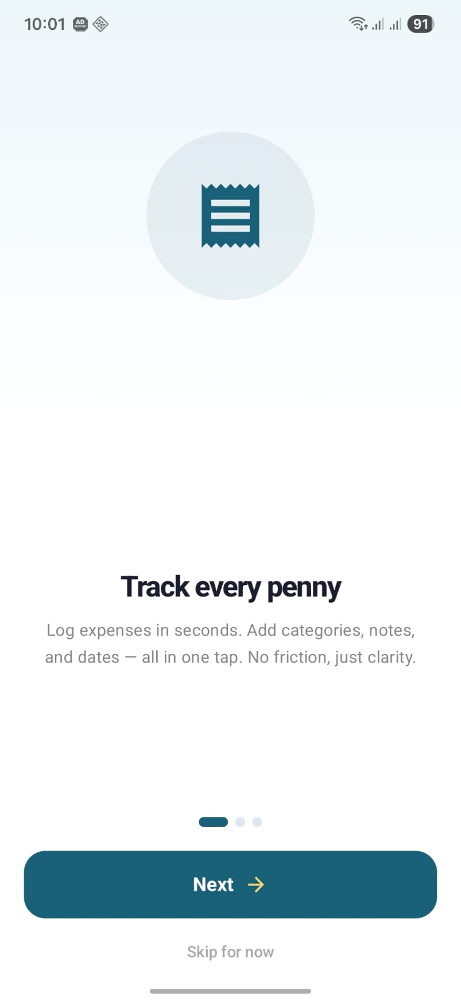 |  |
| **Dashboard** | 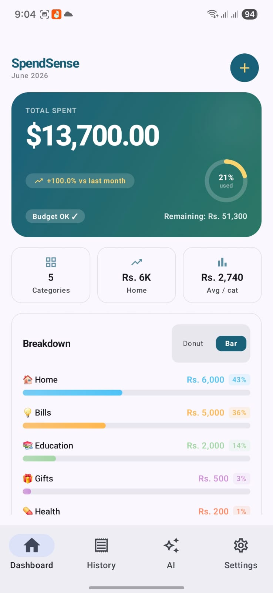 | 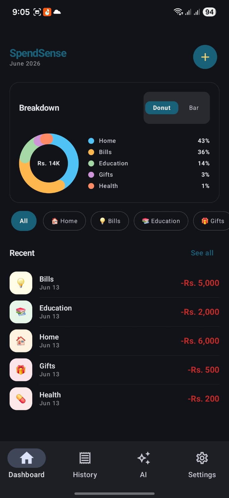 |
| **Add Expense** | 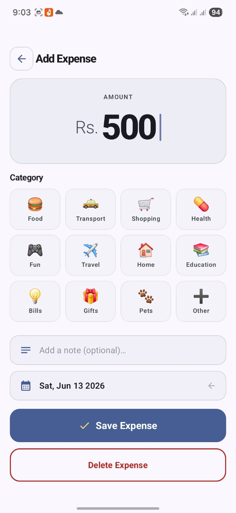 | 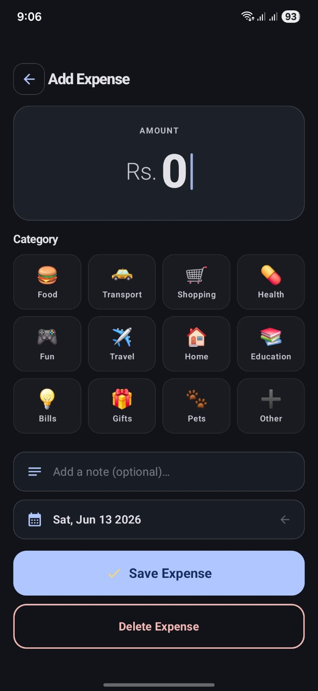 |
| **Expense List** | 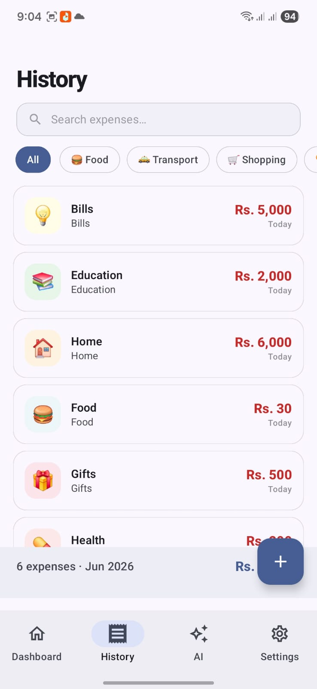 | 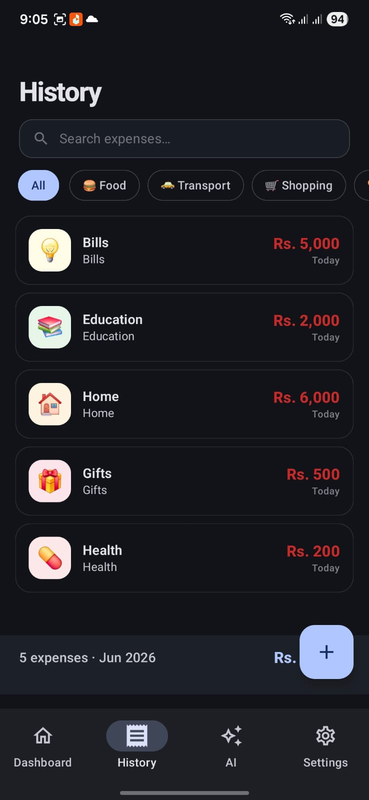 |
| **AI Insights** | 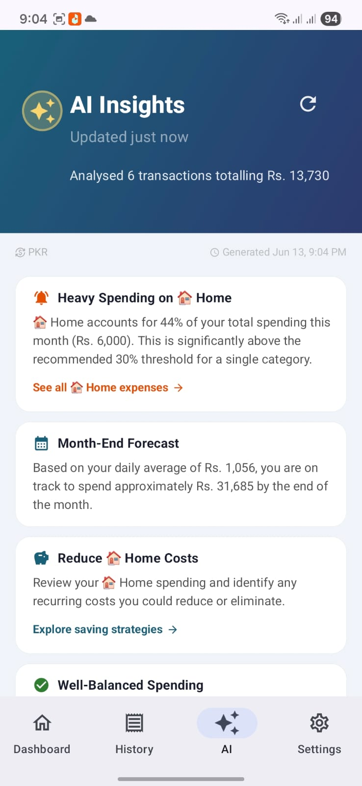 | 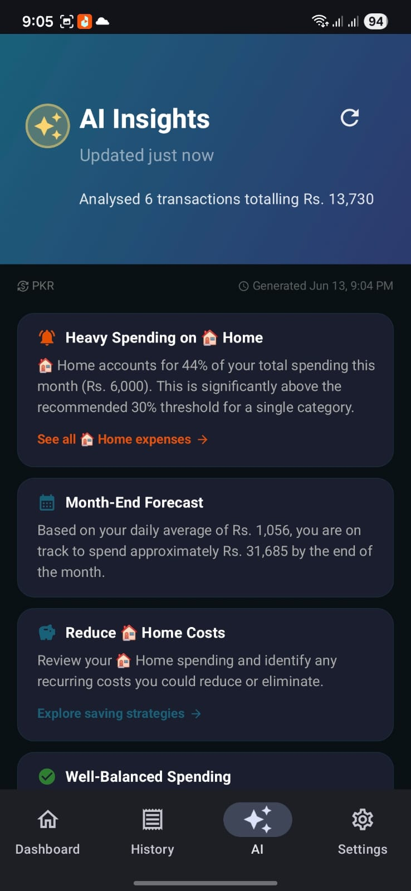 |
| **Settings** | 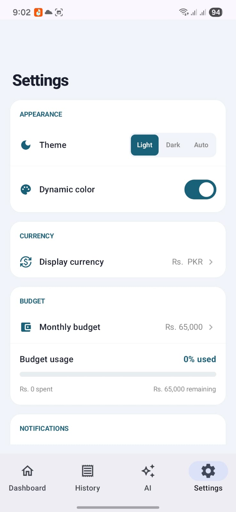 | 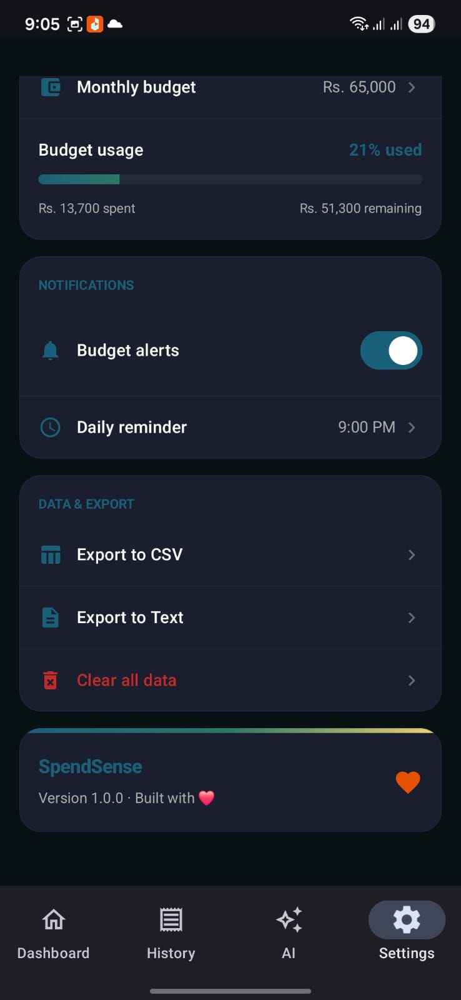 |

> 📸 **Screenshots folder:** All images are stored in `/screenshots/` — add your actual screenshots there.

---

## ✨ Key Features

### 💰 Expense Tracking
- ✅ Add/edit/delete expenses with 12+ categorized options (🍔 Food, 🚕 Transport, 🛒 Shopping, etc.)
- ✅ Search and filter by category or note text
- ✅ Swipe-to-delete with undo snackbar (4-second window)
- ✅ Staggered entry animations for smooth UX

### 📊 Data Visualization
- ✅ Interactive donut chart + horizontal bar chart (toggle)
- ✅ Spending trends (Up/Down/Neutral vs previous month)
- ✅ Recent 5 transactions with category emojis
- ✅ Category breakdown with percentages and colors

### 🤖 AI-Powered Insights
- ✅ Google Gemini 1.5 Flash API integration
- ✅ Generates 3–5 personalized insights per month
- ✅ Insight types: Overspending alerts, saving suggestions, budget forecasts, positive reinforcement, category tips
- ✅ Severity levels: CRITICAL, WARNING, INFO, POSITIVE
- ✅ Mock AI service for offline development (no API key required)

### 🎯 Budget Management
- ✅ Set monthly budget in any currency
- ✅ Visual progress ring with status colors:
  - 🟡 Gold (0–74%): Normal
  - 🟠 Amber (75–89%): Warning
  - 🟠 Orange (90–99%): High Alert
  - 🔴 Red (≥100%): Over Budget
- ✅ Real-time remaining/over-budget calculation

### 💱 Multi-Currency Support
- ✅ 13+ currencies: PKR, USD, EUR, GBP, INR, AED, SAR, CAD, AUD, JPY, CNY, TRY, MYR, SGD
- ✅ Dynamic formatting: PKR = "Rs. 4,000" (0 decimals), USD = "$4,000.00" (2 decimals)
- ✅ User-selectable in Settings — updates everywhere instantly

### 🎨 Modern UI/UX
- ✅ Material 3 with Light/Dark/System themes
- ✅ Dynamic color support (Android 12+ — follows wallpaper)
- ✅ Smooth animations: spring, tween, keyframes, staggered lists
- ✅ Shimmer loading skeletons
- ✅ Glass morphism card designs
- ✅ Typewriter text effect for AI insights

### 📤 Export & Sharing
- ✅ Export to CSV (spreadsheet-compatible)
- ✅ Export to readable text format
- ✅ Share via any app (email, Drive, messaging)

### 🚀 Offline-First
- ✅ All data stored locally in Room Database
- ✅ No internet required for core expense tracking
- ✅ AI insights only need internet when explicitly triggered

---

## 🎯 Problem & Solution

### The Problem

Many people struggle to understand their spending habits. Existing expense trackers fall short:

- **No intelligence** — They just record numbers without offering actionable advice
- **Cluttered UIs** — Overwhelming dashboards with too many options
- **Always-online requirements** — Can't track expenses without internet
- **Single currency only** — No support for users who deal with multiple currencies
- **No budget feedback** — Users don't know if they're overspending until it's too late

### The Solution

**SpendSense** solves these problems by combining effortless expense logging with AI-powered analysis:

✅ **Record in seconds** — Add an expense in under 10 seconds (category + amount)

✅ **Understand instantly** — Beautiful donut charts show exactly where money goes

✅ **Get AI advice** — Receive personalized insights like "You're spending 40% of your budget on Food" or "Try meal prepping to save money"

✅ **Stay on track** — Visual budget ring with color-coded alerts (Gold → Amber → Orange → Red)

✅ **Work offline** — Core features work completely offline; AI insights are optional on-demand

✅ **Global ready** — Support for 13+ currencies with proper formatting

**Result:** Users gain clarity about their spending and receive actionable guidance to save money.

---

## 🛠️ Tech Stack

| Category | Technology | Purpose |
|----------|------------|---------|
| **Language** | Kotlin 2.0 | Modern, concise, null-safe |
| **UI Framework** | Jetpack Compose + Material 3 | Declarative UI, less code, reactive |
| **Architecture** | MVVM + Repository Pattern | Separation of concerns, testability |
| **Dependency Injection** | Dagger Hilt | Boilerplate-free DI, scoped components |
| **Local Database** | Room + Flow | Reactive offline storage, SQLite wrapper |
| **Preferences** | DataStore | Type-safe key-value storage (replaces SharedPreferences) |
| **AI Integration** | Google Gemini 1.5 Flash API | Intelligent spending insights |
| **Networking** | HttpURLConnection (custom) | Lightweight, no extra dependencies |
| **Async Processing** | Kotlin Coroutines + Flow | Thread-safe, structured concurrency |
| **Minimum SDK** | API 24 (Android 7.0) | 95%+ device coverage |
| **Target SDK** | API 34 (Android 14) | Latest platform features |

---

## 🏗️ Architecture (MVVM + Repository)

### Architecture Diagram

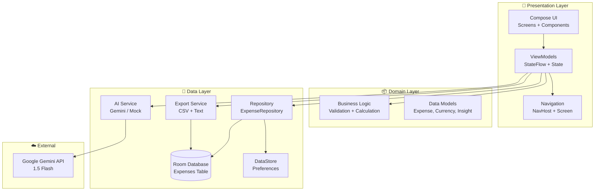

### Data Flow

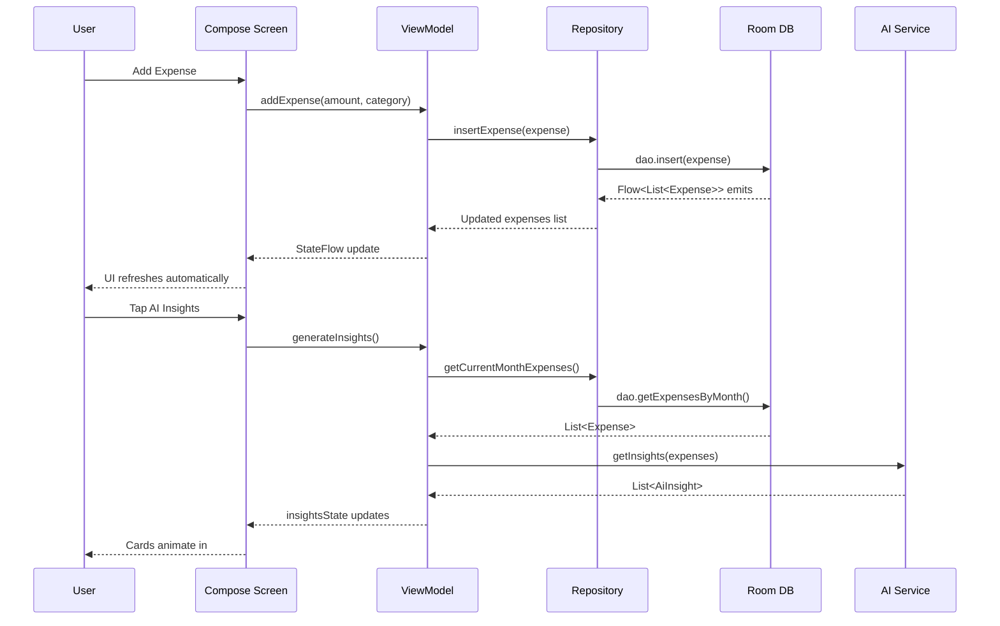

### Key Design Decisions

| Decision | Why |
|----------|-----|
| MVVM + Repository | Separates concerns, makes testing easy, follows Android recommended patterns |
| Room + Flow | Reactive offline storage — UI updates automatically when data changes |
| StateFlow over LiveData | Better integration with Compose, more operators, coroutines friendly |
| Dagger Hilt | Standardized DI for Android, reduces boilerplate |
| HttpURLConnection (no Retrofit) | Minimal dependencies, Gemini API is a simple POST request |
| Mock AI Service | Enables development/testing without API key or internet |
| CurrencyFormatter class | Centralizes currency logic, easy to add new currencies |
| CompositionLocal for SettingsColors | Theme-aware colors without passing parameters everywhere |

---

## 📁 Project Structure

```
app/src/main/java/com/hafsaIlyas/expensetracker/
├── data/
│   ├── ai/
│   │   ├── AiInsightService.kt          # Interface
│   │   ├── GeminiAiService.kt           # Real Gemini API
│   │   └── MockAiInsightService.kt      # Mock for testing
│   ├── currency/
│   │   ├── Currency.kt                  # Data model + formatter
│   │   └── CurrencyService.kt           # Reactive currency provider
│   ├── export/
│   │   └── ExportService.kt             # CSV/Text + share intent
│   ├── local/
│   │   ├── ExpenseDatabase.kt           # Room DB setup
│   │   ├── ExpenseDao.kt                # DAO with Flow
│   │   └── entity/
│   │       └── Expense.kt               # Room entity
│   ├── preferences/
│   │   └── UserPreferencesRepository.kt # DataStore wrapper
│   └── repository/
│       ├── ExpenseRepository.kt         # Interface
│       └── ExpenseRepositoryImpl.kt     # Implementation
├── di/
│   ├── AiModule.kt                      # AI service binding
│   ├── AppModule.kt                     # DB + Repository
│   └── PreferencesModule.kt             # DataStore provider
├── ui/
│   ├── components/
│   │   ├── AnimatedCounter.kt           # Smooth number animation
│   │   ├── CurrencyText.kt              # Currency-aware text
│   │   ├── GlassCard.kt                 # Glass morphism cards
│   │   └── ShimmerEffect.kt             # Loading skeletons
│   ├── navigation/
│   │   ├── NavGraph.kt                  # NavHost setup
│   │   └── Screen.kt                    # Sealed class routes
│   ├── screens/
│   │   ├── addexpense/
│   │   │   ├── AddExpenseScreen.kt
│   │   │   └── AddExpenseUiState.kt
│   │   ├── aiinsights/
│   │   │   ├── AiInsightsScreen.kt
│   │   │   ├── AiInsightUiState.kt
│   │   │   ├── AiInsightViewModel.kt
│   │   │   └── components/
│   │   │       ├── AiHeaderBanner.kt
│   │   │       ├── InsightCard.kt
│   │   │       └── TypewriterText.kt
│   │   ├── dashboard/
│   │   │   ├── DashboardScreen.kt
│   │   │   ├── DashboardUiState.kt
│   │   │   └── components/
│   │   │       ├── CategoryBarChart.kt
│   │   │       ├── CategoryPieChart.kt
│   │   │       └── SpendingHeaderCard.kt
│   │   ├── expenselist/
│   │   │   ├── ExpenseListScreen.kt
│   │   │   └── ExpenseListUiState.kt
│   │   ├── onboarding/
│   │   │   ├── OnboardingScreen.kt
│   │   │   └── OnboardingViewModel.kt
│   │   ├── settings/
│   │   │   ├── SettingsScreen.kt
│   │   │   └── SettingsViewModel.kt
│   │   └── splash/
│   │       └── SplashScreen.kt
│   ├── theme/
│   │   ├── Color.kt                     # Custom color tokens
│   │   ├── Shapes.kt                    # Rounded corner shapes
│   │   ├── Theme.kt                     # Material 3 theming
│   │   └── Type.kt                      # Typography scale
│   └── viewmodel/
│       └── ExpenseViewModel.kt          # Shared ViewModel
└── ExpenseTrackerApplication.kt         # Hilt entry point
```

---

## 🔄 How It Works (User Flow)

### Complete User Journey

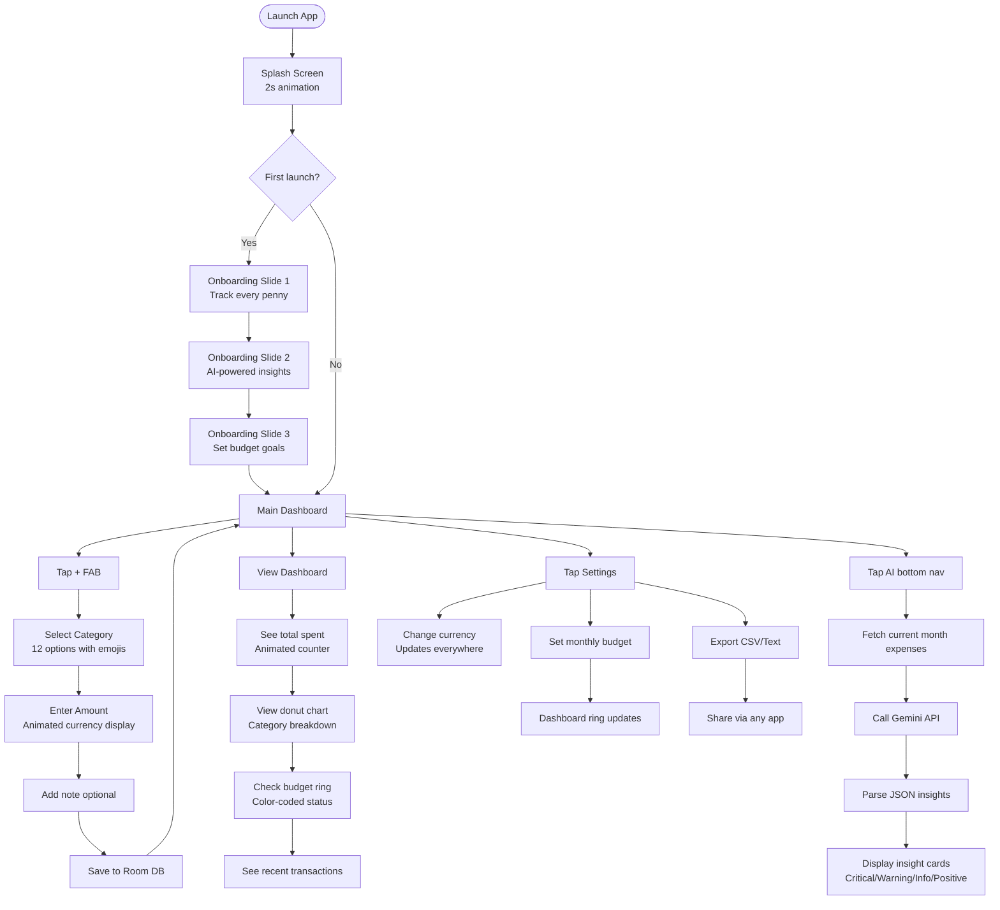

### Navigation Structure

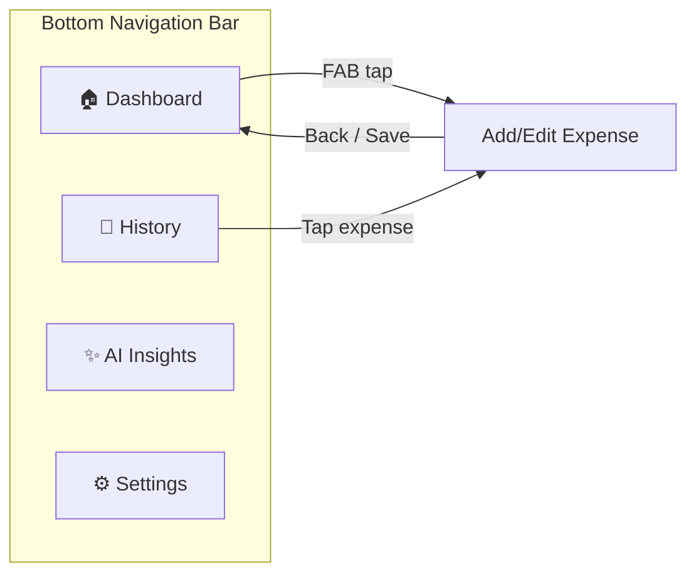

### Feature Flow Summary

| Feature | Steps | Time |
|---------|-------|------|
| Add Expense | Select category → Enter amount → Add note → Save | ~10 seconds |
| View Insights | Tap AI → Wait 2–3 seconds → Read cards | ~5 seconds |
| Set Budget | Settings → Enter amount → Save → Dashboard updates instantly | ~15 seconds |
| Export Data | Settings → Export → Choose format → Share | ~3 seconds |

---

## 🧠 Challenges & Learnings

### Technical Challenges

#### 1. AI Prompt Engineering for Consistent JSON

**Problem:** Gemini API would sometimes return markdown code blocks (` ```json ... ``` `) or extra text, breaking JSON parsing.

**Solution:** Added sanitization before parsing:

```kotlin
val cleaned = response
    .trim()
    .removePrefix("```json")
    .removeSuffix("```")
    .trim()
```

Also added fallback enum parsing: if `InsightType.valueOf()` fails, defaults to `CATEGORY_TIP`.

**Learning:** Always add defensive parsing for external APIs. Never trust the response format 100%.

---

#### 2. Multi-Currency Formatting Differences

**Problem:** Different currencies have different decimal rules — PKR uses 0 decimals ("Rs. 4,000"), USD uses 2 decimals ("$4,000.00"). PKR also needs a space after the symbol.

**Solution:** Created `CurrencyFormatter` class:

```kotlin
class CurrencyFormatter(val currency: Currency) {
    fun format(amount: Double): String {
        val formatted = if (currency.decimalDigits == 0)
            DecimalFormat("#,##0", symbols).format(amount)
        else
            DecimalFormat("#,##0.00", symbols).format(amount)
        return "${currency.symbol}${separator()}$formatted"
    }
}
```

**Learning:** Centralizing formatting logic makes adding new currencies trivial (just add to `SUPPORTED_CURRENCIES` list).

---

#### 3. Offline-First State Management

**Problem:** UI needed to update automatically when Room data changed (add/delete/edit).

**Solution:** Room DAO returns `Flow<List<Expense>>`, ViewModel collects and updates `StateFlow`:

```kotlin
// DAO
@Query("SELECT * FROM expenses ORDER BY date DESC")
fun getAllExpenses(): Flow<List<Expense>>

// ViewModel
repository.getAllExpenses().collect { expenses ->
    _dashboardUiState.update { it.copy(currentMonthTotal = calculateTotal(expenses)) }
}
```

**Learning:** Reactive patterns (Flow + StateFlow + Compose) are powerful but require understanding of backpressure and lifecycle.

---

#### 4. Budget Status Visual Communication

**Problem:** Users needed instant understanding of budget health without reading numbers.

**Solution:** Created 5-level `BudgetStatus` enum with distinct colors and labels:

```kotlin
enum class BudgetStatus { NO_BUDGET, NORMAL, WARNING, HIGH_ALERT, OVER_BUDGET }

val ringColor = when (budgetStatus) {
    NORMAL     -> Gold    // 0–74%
    WARNING    -> Amber   // 75–89%
    HIGH_ALERT -> Orange  // 90–99%
    OVER_BUDGET -> Red    // ≥100%
    else       -> Gray
}
```

**Learning:** Enums simplify complex conditional logic and make code self-documenting.

---

#### 5. DataStore Race Condition on First Launch

**Problem:** On fresh install, `onboardingCompleted` Flow emitted `null` (loading), causing splash to skip onboarding.

**Solution:** Added fallback logic in `MainActivity`:

```kotlin
appState = when (onboardingDone) {
    true  -> AppState.Main
    false -> AppState.Onboarding
    null  -> AppState.Main   // Fallback — rare but safe
}
```

And forced onboarding in debug mode via ViewModel flag for screenshots.

**Learning:** Always handle initial `null` states from DataStore/Flow. Never assume immediate emission.

---

### Key Learnings Summary

| Skill | What I Learned |
|-------|----------------|
| MVVM + Repository | Clean separation makes code testable and maintainable |
| StateFlow + Compose | Eliminates manual UI updates (no `findViewById` callbacks) |
| Room + Flow | Reactive offline storage with minimal boilerplate |
| Dagger Hilt | Reduces DI complexity vs manual injection |
| Material 3 Theming | Custom colors, dynamic color, light/dark themes |
| Gemini API Integration | LLMs accessible via simple REST — no ML expertise needed |
| Multi-Currency | Locale-aware formatting requires careful design |
| Error Handling | Always add fallbacks for external APIs |

---

## 🚀 Installation

### Prerequisites

- Android Studio Hedgehog (2023.1.1) or newer
- JDK 17
- Android SDK (API 24+)
- Android device (USB debugging) or emulator (API 24+)

### Step-by-Step Setup

#### 1. Clone the Repository

```bash
git clone https://github.com/Hafsaailyas/Android-Expense-Tracker-APP.git
cd Android-Expense-Tracker-APP
git checkout current1   # Switch to the complete code branch
```

#### 2. Open in Android Studio

- **File → Open** → Select the project folder
- Wait for Gradle sync (first time may take 3–5 minutes)

#### 3. (Optional) Add Gemini API Key

Create `secrets.properties` in the project root directory (same level as `build.gradle.kts`):

```properties
GEMINI_API_KEY=your_api_key_here
```

Get a free API key:

1. Go to [Google AI Studio](https://aistudio.google.com)
2. Sign in with your Google account
3. Click **"Create API Key"**
4. Copy and paste into `secrets.properties`

> **Note:** The app works perfectly without an API key — it will use `MockAiInsightService` automatically.

#### 4. Build the Project

**Build → Make Project** (`Ctrl+F9` / `Cmd+F9`)

#### 5. Run the App

Connect Android device (enable USB debugging) or start emulator, then:

**Run → Run 'app'** (`Shift+F10`)

---

### Switching Between Real AI and Mock AI

In `di/AiModule.kt`, toggle the binding:

```kotlin
@Module
@InstallIn(SingletonComponent::class)
abstract class AiModule {
    @Binds
    @Singleton
    abstract fun bindAiInsightService(
        // Use MOCK (no API key needed):
        impl: MockAiInsightService

        // Use REAL Gemini (requires API key):
        // impl: GeminiAiService
    ): AiInsightService
}
```

---

### Common Issues & Solutions

| Issue | Solution |
|-------|----------|
| Gradle sync fails | File → Invalidate Caches → Restart |
| API key not found | Ensure `secrets.properties` is in project root (not `app/` folder) |
| Emulator slow | Use hardware device or reduce emulator RAM to 2 GB |
| Compose compilation error | Ensure JDK 17 is selected (File → Project Structure → SDK Location) |

---

## 🔮 Future Enhancements

These features are planned for future releases:

- [ ] **Cloud Backup** — Sync expenses across multiple devices using Firebase
- [ ] **Recurring Expenses** — Subscription tracking with automatic monthly addition
- [ ] **Receipt Scanning** — OCR to auto-fill expense details from receipt photos
- [ ] **Multiple Budgets** — Separate budgets for categories (e.g., ₹5,000 for Food)
- [ ] **Export to PDF** — Professional financial reports with charts
- [ ] **Home Screen Widget** — Quick-add expense without opening app
- [ ] **Wear OS Companion** — Add expenses from smartwatch
- [ ] **Advanced AI** — Anomaly detection, long-term trend forecasting
- [ ] **Category Budgets** — Individual spending limits per category
- [ ] **Multi-account Support** — Track different bank accounts/cash separately

**Contributions welcome!** Feel free to open issues or PRs.

---

## 👩‍💻 Author

**Hafsa Ilyas**

- GitHub: [@Hafsaailyas](https://github.com/Hafsaailyas)
- LinkedIn: [Hafsa Ilyas](https://linkedin.com/in/hafsa-ilyas)

**Skills demonstrated in this project:**
- Android Development (Kotlin, Jetpack Compose)
- Modern Architecture (MVVM, Repository, Hilt)
- Offline-First Design (Room, Flow, DataStore)
- AI Integration (Google Gemini API)
- Material 3 + Custom Theming
- Multi-Currency Systems
- REST API Integration
- Coroutines & Asynchronous Programming

---

## 📄 License

This project is licensed under the **MIT License** — see the [LICENSE](LICENSE) file for details.

---

## 🙏 Acknowledgements

- **Google** — For Jetpack Compose, Room, Material 3, and Gemini API
- **Material Design Team** — For design inspiration and guidelines
- **Android Open Source Community** — For libraries and learning resources
- **Google AI Studio** — For free Gemini API access
- **All contributors and testers** — For feedback and improvements

---

## 📱 Screenshots Folder

Create the `screenshots/` folder in your project root and add:

```
screenshots/
├── splash-screen.jpeg
├── onboarding-1.jpeg
├── onboarding-2.jpeg
├── onboarding-3.jpeg
├── onboarding-dark.jpeg
├── dashboard-light.jpeg
├── dashboard-dark.jpeg
├── add-expense.jpeg
├── add-expense-dark.jpeg
├── expense-list.jpeg
├── expense-list-dark.jpeg
├── ai-insights.jpeg
├── ai-insights-dark.jpeg
├── settings.jpeg
└── settings-dark.jpeg
```

---

## 🔗 Repository Branch

**Complete source code is on the `current1` branch:**

[https://github.com/Hafsaailyas/Android-Expense-Tracker-APP/tree/current1](https://github.com/Hafsaailyas/Android-Expense-Tracker-APP/tree/current1)

---

⭐ **If you find this project useful, please star the repository!**
